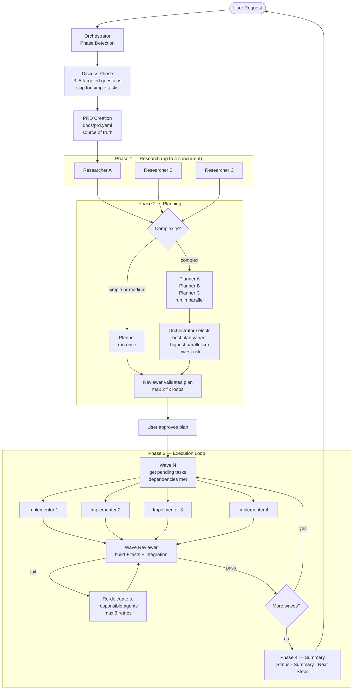
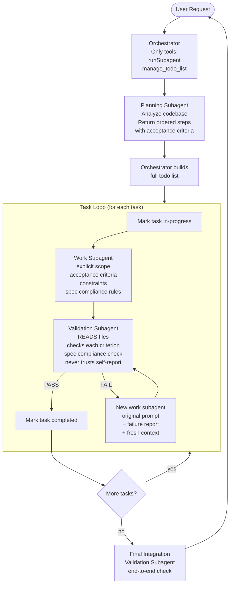
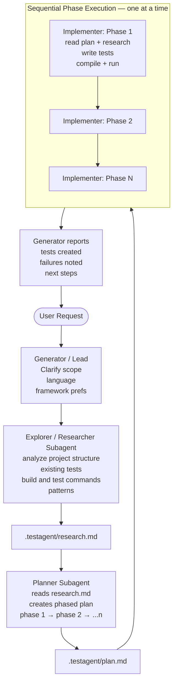
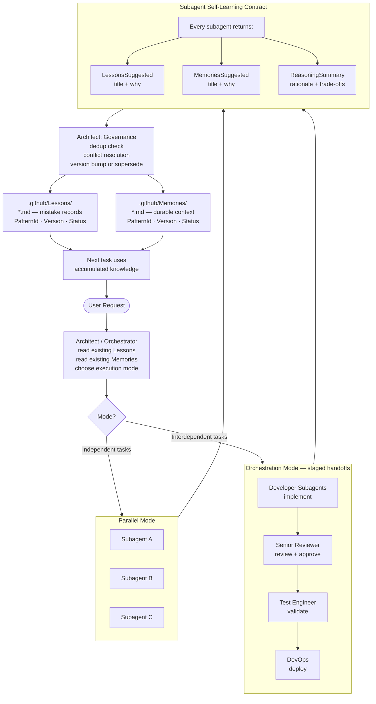
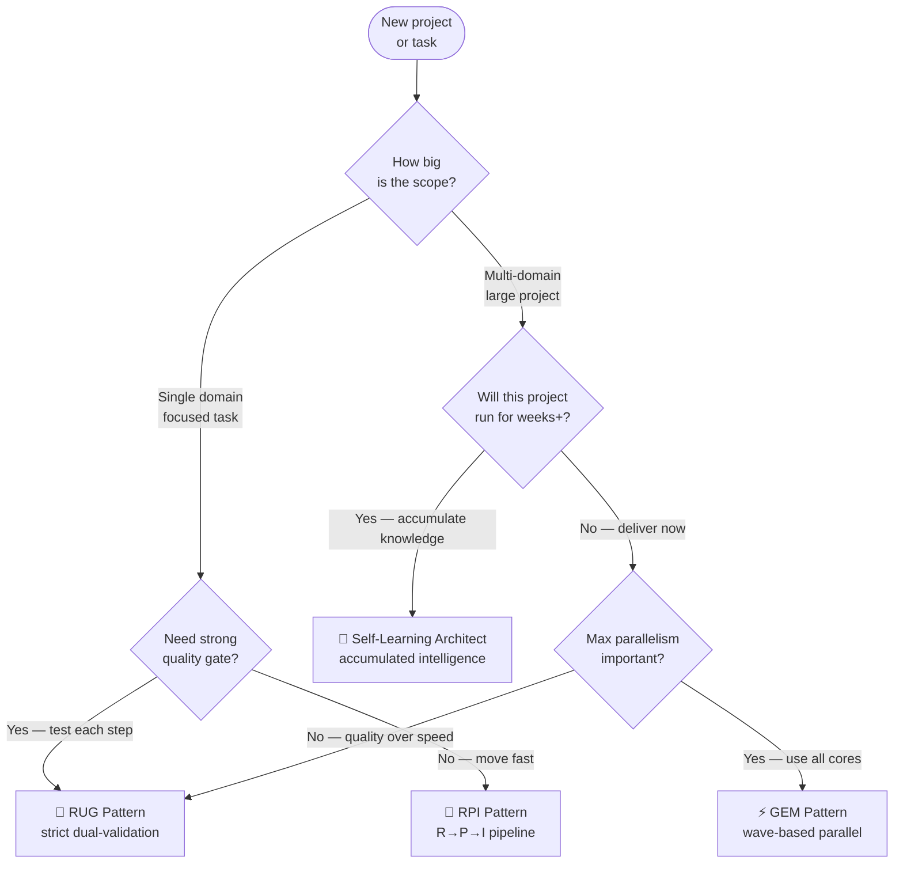

# Multi-Agent Orchestration Guide

A practical guide to the four multi-agent coordination patterns found in this repository — when to use each, how they differ, their trade-offs, and the file paths to get started.

---

## Universal Agent Roles

Across all four patterns, five roles repeat. Each pattern activates a different subset and wires them differently.

| Role                    | Responsibility                                                       | Never Does                          |
| ----------------------- | -------------------------------------------------------------------- | ----------------------------------- |
| **Orchestrator / Lead** | Detects phase, routes work, synthesizes results, owns the plan state | Writes code or edits files directly |
| **Planner**             | Decomposes the objective into ordered tasks/phases with dependencies | Implements anything                 |
| **Coder / Implementer** | Writes code, edits files, runs builds                                | Makes architectural decisions       |
| **Tester / Reviewer**   | Validates output against acceptance criteria, checks quality gates   | Accepts self-reported completion    |
| **Explorer**            | Reads files, searches codebases, gathers research findings           | Modifies anything                   |

The four patterns differ in how strictly these roles are separated, how much runs in parallel, and whether the system learns from its own mistakes.

---

## The Four Patterns at a Glance

|                  | GEM                                              | RUG                                                          | RPI                                         | Self-Learning Architect                       |
| ---------------- | ------------------------------------------------ | ------------------------------------------------------------ | ------------------------------------------- | --------------------------------------------- |
| **Core idea**    | Wave-based parallel execution with quality gates | Total delegation — orchestrator does zero implementation     | Sequential Research→Plan→Implement pipeline | Multi-agent team with institutional memory    |
| **Parallelism**  | Up to 4 concurrent agents per wave               | Work + validation run concurrently per task                  | Strictly sequential phases                  | Parallel or orchestrated, chosen per task     |
| **Self-healing** | Wave integration checks, 3 retries per task      | Separate validation agent per task, retry with fresh context | None — reports failure                      | Per-subagent lesson capture + dedup           |
| **Memory**       | None (plan.yaml is source of truth)              | Todo list only                                               | `.testagent/` state files                   | `.github/Lessons/` + `.github/Memories/`      |
| **Best for**     | Large projects, many interdependent tasks        | Strict quality culture, spec adherence critical              | Focused single-domain pipelines             | Long-running projects, accumulating knowledge |
| **Main cost**    | Orchestration overhead                           | Slower — every task validated twice                          | Linear, no parallelism benefit              | Memory management overhead                    |

---

## Pattern 1 — GEM: Wave-Based Parallel Orchestration

**File:** [`agents/gem-orchestrator.agent.md`](../agents/gem-orchestrator.agent.md)  
**Supporting agents:**

| Agent                | File                                                                                      |
| -------------------- | ----------------------------------------------------------------------------------------- |
| Researcher           | [`agents/gem-researcher.agent.md`](../agents/gem-researcher.agent.md)                     |
| Planner              | [`agents/gem-planner.agent.md`](../agents/gem-planner.agent.md)                           |
| Implementer          | [`agents/gem-implementer.agent.md`](../agents/gem-implementer.agent.md)                   |
| Reviewer             | [`agents/gem-reviewer.agent.md`](../agents/gem-reviewer.agent.md)                         |
| Browser Tester       | [`agents/gem-browser-tester.agent.md`](../agents/gem-browser-tester.agent.md)             |
| DevOps               | [`agents/gem-devops.agent.md`](../agents/gem-devops.agent.md)                             |
| Documentation Writer | [`agents/gem-documentation-writer.agent.md`](../agents/gem-documentation-writer.agent.md) |

### How it works



### Key mechanics

- **PRD-first**: Before any planning, `docs/prd.yaml` is created from the discussion phase. It defines scope, user stories, and acceptance criteria — the plan must satisfy it.
- **Plan variant selection**: For complex tasks, three planners run in parallel producing variants A/B/C. The orchestrator picks the one with the most wave-1 tasks (maximum parallelism), fewest total dependencies, and lowest risk score.
- **Wave execution**: Tasks are grouped by wave. Within a wave, up to 4 agents run concurrently. Tasks that share the same file targets are serialized within the wave to avoid conflicts.
- **Wave integration check**: After each wave, `gem-reviewer` validates that build passes, tests pass, and no integration failures emerged from that wave's combined changes.
- **Delegation protocol**: Every subagent receives a structured JSON payload — no ambiguity about task_id, plan_id, and task_definition.

### When to choose GEM

- You have a large, multi-domain objective with many tasks
- Speed matters — you want maximum parallelism
- You need structured requirements (PRD) before execution starts
- The project involves multiple specialties: frontend, backend, DevOps, docs
- You want wave-level quality gates between logical phases of work

### Trade-offs

| Pro                                                 | Con                                                   |
| --------------------------------------------------- | ----------------------------------------------------- |
| Maximum parallelism per wave                        | High orchestration overhead                           |
| PRD enforces scope discipline                       | Complex setup — 7 agents to configure                 |
| Wave gates catch integration failures early         | Orchestrator must never do implementation work itself |
| Plan variant selection finds better execution paths | Multiple planners cost more than one                  |

---

## Pattern 2 — RUG: Repeat Until Good (Pure Delegation)

**File:** [`agents/rug-orchestrator.agent.md`](../agents/rug-orchestrator.agent.md)  
**Supporting agents:**

| Agent                   | File                                                              |
| ----------------------- | ----------------------------------------------------------------- |
| SWE (Software Engineer) | [`agents/swe-subagent.agent.md`](../agents/swe-subagent.agent.md) |
| QA                      | [`agents/qa-subagent.agent.md`](../agents/qa-subagent.agent.md)   |

### How it works



### Key mechanics

- **The Cardinal Rule**: The orchestrator touches only `runSubagent` and `manage_todo_list`. Every other action — including reading a single file — must be delegated to a subagent.
- **Work + Validation pairs**: Every task gets two subagents. The validation agent reads the actual files and checks each acceptance criterion against evidence, never against the work subagent's claims.
- **Spec adherence enforcement**: When the user specifies a technology/language/framework, both the work prompt and the validation prompt echo it as a non-negotiable hard constraint with explicit negative constraints ("Do NOT substitute alternatives").
- **Fresh context on retry**: When validation fails, a new work subagent is launched with the original full prompt plus the failure report. The orchestrator does not reuse mental context from the failed attempt.
- **Integration validation**: After all tasks complete, a final integration subagent verifies everything works together.

### When to choose RUG

- Specification adherence is critical (the user chose specific tech for a reason)
- You've been burned by agents that falsely report completion
- Your task has clear, verifiable acceptance criteria per step
- You want the strictest possible quality control at each step
- Context window management is critical (delegating everything preserves orchestrator clarity)

### Trade-offs

| Pro                                              | Con                                          |
| ------------------------------------------------ | -------------------------------------------- |
| Catches false self-reported completion           | 2x subagent cost — every task runs twice     |
| Spec compliance is verified, not assumed         | Slower than patterns without dual validation |
| Orchestrator stays sharp across massive tasks    | Requires tightly written acceptance criteria |
| Retry with fresh context avoids cascade failures | No built-in parallelism within a task        |

---

## Pattern 3 — RPI: Research → Plan → Implement Pipeline

**File:** [`agents/polyglot-test-generator.agent.md`](../agents/polyglot-test-generator.agent.md)  
**Supporting agents:**

| Agent       | File                                                                                        |
| ----------- | ------------------------------------------------------------------------------------------- |
| Researcher  | [`agents/polyglot-test-researcher.agent.md`](../agents/polyglot-test-researcher.agent.md)   |
| Planner     | [`agents/polyglot-test-planner.agent.md`](../agents/polyglot-test-planner.agent.md)         |
| Implementer | [`agents/polyglot-test-implementer.agent.md`](../agents/polyglot-test-implementer.agent.md) |

### How it works



### Key mechanics

- **State in the filesystem**: All state lives in `.testagent/` — `research.md`, `plan.md`, optionally `status.md`. Any agent can read these files without relying on context from previous turns.
- **Strictly sequential phases**: Phase N+1 never starts until Phase N is complete and passing. This prevents cascading failures where a broken foundation invalidates later work.
- **Polyglot explorer**: The researcher detects the language, testing framework, and build commands — no assumptions baked into the lead agent.
- **Simple coordinator**: The generator is lightweight — it just calls three subagents in sequence and reports results. No complex routing logic needed.

### When to choose RPI

- You have a focused, single-domain task (test generation, migration, refactoring)
- The task naturally breaks into research → plan → implement phases
- You need reproducibility — file-based state survives session restarts
- Simplicity is more important than speed
- Each phase meaningfully depends on the previous phase's output

### Trade-offs

| Pro                                           | Con                                             |
| --------------------------------------------- | ----------------------------------------------- |
| Simple to understand and debug                | No parallelism — phases are strictly linear     |
| File-based state is inspectable and resumable | Generator has no retry or self-healing logic    |
| Minimal orchestration overhead                | Not designed for multi-domain objectives        |
| Easy to adapt to new domains                  | Failure in Phase 2 blocks all subsequent phases |

---

## Pattern 4 — Self-Learning Architect: Accumulated Intelligence

**File:** [`agents/dotnet-self-learning-architect.agent.md`](../agents/dotnet-self-learning-architect.agent.md)

### How it works



### Key mechanics

- **Self-learning contract**: Every subagent brief explicitly instructs the agent to record mistakes to `.github/Lessons/` and durable insights to `.github/Memories/`. The output contract requires `LessonsSuggested`, `MemoriesSuggested`, and `ReasoningSummary` — not optional.
- **Versioned patterns**: Every lesson and memory carries `PatternId`, `PatternVersion`, and `Status` (active / deprecated / blocked). Two patterns with conflicting guidance cannot both be `active` — the newer must supersede the older.
- **Safety gate**: Patterns with `Status: blocked` are never applied. Reactivation requires explicit validation evidence and user confirmation.
- **Pre-write dedup**: Before creating any new lesson or memory, the architect searches existing artifacts for the same root cause or decision. Matches are updated, not duplicated.
- **Mode selection**: Before delegating, the architect explicitly chooses Parallel Mode (independent tasks, no shared write conflicts) or Orchestration Mode (staged handoffs, role-based review gates). If the boundary is unclear, it asks the user.

### When to choose Self-Learning Architect

- The project will span many sessions and you want knowledge to persist
- Mistakes are expensive and must not be repeated
- You work in a well-defined domain (.NET/Azure in this case, adaptable to others)
- You want the agent team to get better at your project over time
- You need architecture decisions to be documented and versioned

### Trade-offs

| Pro                                                   | Con                                                    |
| ----------------------------------------------------- | ------------------------------------------------------ |
| Knowledge accumulates across runs — team gets smarter | Memory management overhead per task                    |
| Mistakes are documented, not just silently retried    | Governance logic adds complexity                       |
| Architecture decisions are versioned and traceable    | Requires discipline to keep lessons/memories clean     |
| Conflicting guidance is resolved explicitly           | .NET/Azure focused — needs adaptation for other stacks |

---

## Decision Guide: Which Pattern to Choose?



### Quick reference card

| Situation                                             | Pattern                     |
| ----------------------------------------------------- | --------------------------- |
| "Generate tests for this Python project"              | **RPI**                     |
| "Build this feature — must use React, no substitutes" | **RUG**                     |
| "Implement this multi-service system end to end"      | **GEM**                     |
| "Keep improving this .NET codebase over months"       | **Self-Learning Architect** |
| "I've had agents lie about being done"                | **RUG**                     |
| "I need this shipped fast across 5 domains"           | **GEM**                     |
| "We keep making the same mistakes"                    | **Self-Learning Architect** |
| "Simple focused task, clear phases"                   | **RPI**                     |

---

## Flow Comparison: Same Task, Four Patterns

> Task: "Add authentication to this API"

### GEM

1. Discuss phase → 3 questions about auth strategy
2. Create `docs/prd.yaml` with scope and acceptance criteria
3. Three researchers run in parallel: security patterns, existing middleware, user model
4. Three planners create variants → orchestrator picks best
5. Wave 1: User model + token schema (concurrent)
6. Wave 2: Middleware + endpoints (concurrent), blocked on Wave 1
7. Wave integration check after each wave
8. Summary with next recommended steps

### RUG

1. Planning subagent reads codebase → returns 6 ordered steps with criteria
2. Step 1 (user model): work agent → validation agent verifies file exists and schema is correct
3. Step 2 (auth middleware): work agent → validation agent reads middleware and checks each criterion
4. Repeat for all 6 steps — never trust self-report
5. Final integration validation subagent runs end-to-end

### RPI

1. Researcher reads codebase structure, existing auth patterns, test framework
2. Planner creates 3 phases: model → middleware → tests
3. Implementer runs Phase 1, waits for pass
4. Implementer runs Phase 2, waits for pass
5. Implementer runs Phase 3, waits for pass

### Self-Learning Architect

1. Reads `.github/Memories/` — finds a prior memory noting JWT is preferred over sessions
2. Chooses Orchestration Mode — auth is high-risk, needs senior review
3. Developer implements, Senior Reviewer approves, Test Engineer validates
4. Each subagent returns `LessonsSuggested` / `MemoriesSuggested`
5. Orchestrator deduplicates and creates/updates `.github/Memories/auth-patterns.md`
6. Next auth task in this project reuses accumulated decisions

---

## Combining Patterns

These patterns are not mutually exclusive. Common combinations:

| Combination             | When                                                                                  |
| ----------------------- | ------------------------------------------------------------------------------------- |
| **GEM + Self-Learning** | Add learning contracts to GEM's delegation protocol for long-running projects         |
| **RUG + RPI**           | Use RPI phases but add a validation subagent after each phase (RUG's dual-validation) |
| **Self-Learning + RPI** | Use RPI's file-based state with Self-Learning's memory governance                     |

The core idea: pick the **execution model** (wave-parallel vs. sequential vs. pure delegation) separately from the **learning model** (ephemeral vs. accumulated).

---

## File Reference Map

```
awesome-copilot/
├── agents/
│   │
│   │  ── Pattern 1: GEM ────────────────────────────────────────
│   ├── gem-orchestrator.agent.md          # Wave orchestration, PRD creation
│   ├── gem-researcher.agent.md            # Domain research, up to 4 parallel
│   ├── gem-planner.agent.md               # DAG-based plan with pre-mortem
│   ├── gem-implementer.agent.md           # File edits, builds
│   ├── gem-reviewer.agent.md              # Plan / task / wave validation
│   ├── gem-browser-tester.agent.md        # UI and browser test execution
│   ├── gem-devops.agent.md                # Deployment and infrastructure
│   ├── gem-documentation-writer.agent.md  # Walkthroughs and API docs
│   │
│   │  ── Pattern 2: RUG ────────────────────────────────────────
│   ├── rug-orchestrator.agent.md          # Pure delegation orchestrator
│   ├── swe-subagent.agent.md              # Senior SWE — implementation
│   ├── qa-subagent.agent.md               # QA — validation only
│   │
│   │  ── Pattern 3: RPI ────────────────────────────────────────
│   ├── polyglot-test-generator.agent.md   # Coordinator / lead
│   ├── polyglot-test-researcher.agent.md  # Codebase explorer + research
│   ├── polyglot-test-planner.agent.md     # Phase-based plan creator
│   ├── polyglot-test-implementer.agent.md # Per-phase test writer
│   │
│   │  ── Pattern 4: Self-Learning ────────────────────────────────
│   └── dotnet-self-learning-architect.agent.md  # Orchestrator + learning governance
│
├── plugins/
│   ├── gem-team/                    # GEM pattern as installable plugin
│   └── polyglot-test-agent/         # RPI pattern as installable plugin
│
└── docs/
    └── multi-agent-orchestration-guide.md   # ← this file
```

---

## Key Principles Shared Across All Patterns

1. **Orchestrators never implement.** The lead agent routes, synthesizes, and decides. It does not write code, edit files, or run commands.

2. **Validation is separate from implementation.** The agent that does the work should not be the one that certifies the work is complete. Use a reviewer/validator subagent.

3. **State is explicit.** Whether it's `plan.yaml` (GEM), a todo list (RUG), `.testagent/plan.md` (RPI), or `.github/Memories/` (Self-Learning), the current state is written somewhere the orchestrator can read — it does not rely on conversation context.

4. **Retry with fresh context.** When a task fails, the retry subagent gets the original prompt plus the failure report — not a modified version of "try harder." Fresh context window, full specification, specific failure information.

5. **Delegation scope must be explicit.** Every subagent prompt must include: what to do, which files to touch, which files NOT to touch, acceptance criteria, and what to report back.
